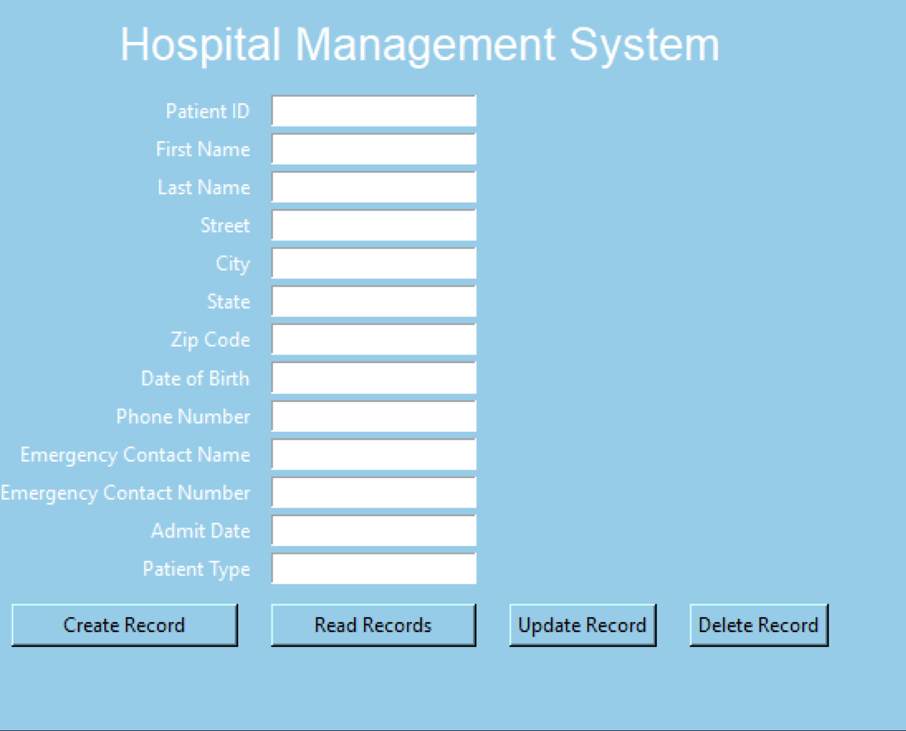

# Hospital Management System

## Overview
The Hospital Management System is a comprehensive database management and design project aimed at revolutionizing healthcare administration. Through meticulous planning and implementation, this system provides a robust and efficient solution to streamline various facets of hospital operations.

## Features
- **Patient Management**: Efficient handling of patient records, appointments, and medical histories.
- **Staff Scheduling**: Streamlined scheduling for doctors, nurses, and other healthcare staff.
- **Inventory Control**: Effective management of medical supplies and equipment inventory.
- **Billing Processes**: Accurate and automated billing and invoicing.

## Technologies Used
- **Database Management**: Advanced database technologies to ensure robust and reliable performance.
- **Automation**: Automated processes to enhance efficiency and reduce manual workload.
- **Data Integrity**: High standards of data accuracy and security to ensure patient care and satisfaction.

## Benefits
- **Efficiency**: Enhanced operational efficiency through streamlined processes.
- **Accuracy**: Improved accuracy in patient records and billing.
- **Patient Care**: Better patient care delivery leading to improved outcomes and satisfaction.
- **Decision-Making**: Data-driven decision-making to transform the healthcare landscape.

## Screenshots

### Graphical User Interface (GUI)

*Small Scale Graphical User Inferace for the Patient table*

### Power BI Dashboards

*PowerBI analytics dashboard showcasing the various analytics the data shows for tracking and scheduling purposes*

## Usage
1. **Login**: Use your credentials to log in to the system.
2. **Dashboard**: Access the main dashboard to navigate different features.
3. **Patient Management**: Add, edit, or view patient records.
4. **Staff Scheduling**: Manage staff schedules efficiently.
5. **Inventory Control**: Monitor and update inventory levels.
6. **Billing**: Generate and manage bills and invoices.

## Contribution
We welcome contributions to improve the Hospital Management System. Please follow these steps to contribute:
1. Fork the repository.
2. Create a new branch: `git checkout -b feature-branch`
3. Make your changes.
4. Commit your changes: `git commit -m 'Add new feature'`
5. Push to the branch: `git push origin feature-branch`
6. Create a pull request.

## License
This project is licensed under the MIT License. See the [LICENSE](LICENSE) file for details.

## Contact
For any questions or suggestions, please contact us at [email@example.com](mailto:aniketpatole@gmail.com).
